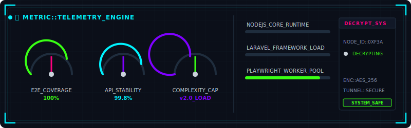
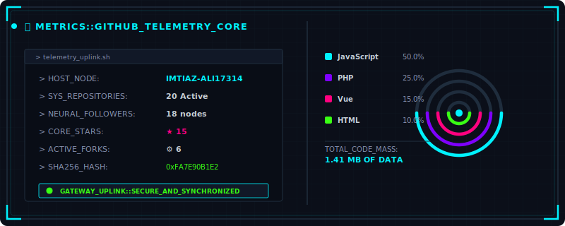
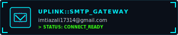
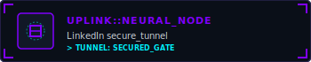

<!--
========================================================================
🤖 SYSTEM: DEV_OS INITIALIZED
👤 ENGINEER: IMTIAZ ALI (FULL-STACK DEVELOPER & QA AUTOMATION ENGINEER)
🇵🇰 ORIGIN: PAKISTAN
💬 "Curiously inspecting the source? You are a true engineer! Let's connect!"
========================================================================
-->

<h1 align="center">
  
</h1>

<h3 align="center">
  Full-Stack Developer & QA Automation Engineer from Pakistan 🇵🇰
</h3>

<p align="center">
  A rapid-learning engineer focused on clean, conceptual backend design and robust end-to-end automation pipelines.
</p>

<p align="center">
  
</p>

<div align="center">
  
  
  
  
</div>

<br/>

---

## ⚡ System Diagnostics

```yaml
system:
  host: Imtiaz Ali
  roles:
    - Full-Stack Developer
    - QA Automation Engineer
  active_node: Softleed
  location: Pakistan (GMT+5)
  runtime_stack: [Node.js, Laravel, React.js, Vue.js, Playwright]
  capabilities: [Full-Stack Development, E2E Test Pipelines, Desktop Integration]
  diagnostics:
    learning_curve: "Steep / Ultra-Rapid"
    adaptability: "Seamless stack transitions & deep conceptual grasp"
    delivery_standard: "High-quality, reliable, clean-code architecture"
```

<br/>

---

## ⚙️ Hardware & Software Subsystems

<table align="center" style="border: 1px solid #1f2328; border-collapse: collapse; text-align: center; width: 100%;">
  <tr style="background-color: #161b22;">
    <th style="padding: 10px; border: 1px solid #1f2328; color: #00F2FE; width: 33%;">💻 Backend Engine</th>
    <th style="padding: 10px; border: 1px solid #1f2328; color: #7F00FF; width: 33%;">🎨 Frontend Interface</th>
    <th style="padding: 10px; border: 1px solid #1f2328; color: #39FF14; width: 34%;">🛡️ Automation & Delivery</th>
  </tr>
  <tr>
    <td style="padding: 15px; border: 1px solid #1f2328; vertical-align: top;">
      <br/><br/>
      <strong>Scalable Services</strong><br/>
      Node.js Runtimes & Laravel MVCs<br/>
      Relational Database Design<br/>
      High-Throughput Web APIs
    </td>
    <td style="padding: 15px; border: 1px solid #1f2328; vertical-align: top;">
      <br/><br/>
      <strong>Interactive Clients</strong><br/>
      React & Vue Interfaces<br/>
      Desktop Apps (Electron)<br/>
      Sleek Responsive Layouts
    </td>
    <td style="padding: 15px; border: 1px solid #1f2328; vertical-align: top;">
      <div align="center">
        <br/>
        <br/>
        <strong>Stability & Quality</strong><br/>
        E2E Browser Automation (Playwright)<br/>
        Visual Testing & Custom CI Actions<br/>
        Interface Prototyping (Figma)
      </div>
    </td>
  </tr>
</table>

<br/>

<div align="center">
  <code>Backend Dev (Node/Laravel) [ ██████████████░░░░░ ] 70%</code> &nbsp;&nbsp;|&nbsp;&nbsp;
  <code>Frontend Dev (React/Vue)    [ ████████████░░░░░░░ ] 60%</code> &nbsp;&nbsp;|&nbsp;&nbsp;
  <code>QA Automation (Playwright)  [ ███████████████░░░░ ] 75%</code>
</div>

<br/>

---

## 📊 System Metrics & Diagnostics

<p align="center">
  
</p>

<p align="center">
  
</p>

<br/>

---

## 🏆 System Achievements & Core Milestones

<table align="center" style="border: 1px solid #1f2328; border-collapse: collapse; text-align: center; width: 100%;">
  <tr style="background-color: #161b22;">
    <th style="padding: 12px; border: 1px solid #1f2328; color: #00F2FE; width: 25%; font-size: 15px;">🛡️ QA Automation</th>
    <th style="padding: 12px; border: 1px solid #1f2328; color: #7F00FF; width: 25%; font-size: 15px;">💻 Backend Dev</th>
    <th style="padding: 12px; border: 1px solid #1f2328; color: #39FF14; width: 25%; font-size: 15px;">🎨 Frontend Dev</th>
    <th style="padding: 12px; border: 1px solid #1f2328; color: #FF007F; width: 25%; font-size: 15px;">⚡ Learning Velocity</th>
  </tr>
  <tr>
    <td style="padding: 20px; border: 1px solid #1f2328; vertical-align: top;">
      🏆<br/><strong>E2E Developer</strong><br/>
      <small>Playwright Automation & Integration</small>
    </td>
    <td style="padding: 20px; border: 1px solid #1f2328; vertical-align: top;">
      🏆<br/><strong>API Developer</strong><br/>
      <small>Node.js & Laravel Web Services</small>
    </td>
    <td style="padding: 20px; border: 1px solid #1f2328; vertical-align: top;">
      🏆<br/><strong>UI Developer</strong><br/>
      <small>React, Vue & Desktop Clients</small>
    </td>
    <td style="padding: 20px; border: 1px solid #1f2328; vertical-align: top;">
      🏆<br/><strong>Rapid Adapter</strong><br/>
      <small>Deep Conceptual Grasp & Swift Execution</small>
    </td>
  </tr>
</table>

<br/>

---

## 🛰️ Communication Uplinks

<p align="center">
  Open for collaboration, architectural design consulting, or professional discussion.
</p>

<div align="center">
  <a href="mailto:imtiazali17314@gmail.com">
    
  </a>
  &nbsp;&nbsp;
  <a href="https://www.linkedin.com/in/imtiaz-ali-79476a385/" target="_blank" rel="noopener noreferrer">
    
  </a>
</div>

<br/>

<!--
🚀 SYSTEM DISPATCH: EOF (End of File)
Thank you for visiting! Feel free to fork this system structure.
-->
